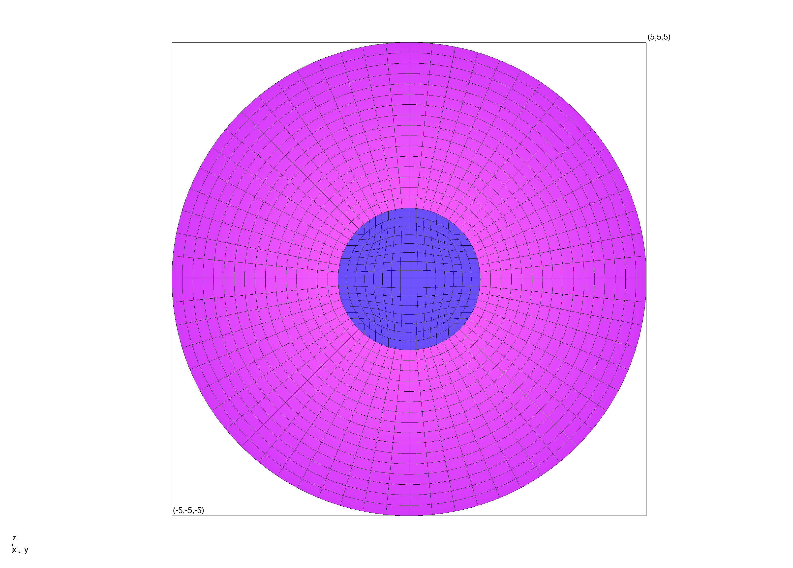

# Stroid
## A multi-block mesh generation tool for stellar modeling

Stroid is a simple multi-block mesh generation tool designed to generate multi-domain
meshes for 3D finite element modeling of stellar physics. It uses the MFEM library for
mesh generation and manipulation and is capable of generating high-order curvilinear
and non-singular meshes.

> Note: Stroid is under active development and is not yet stable. Features and interfaces may change in future releases.

## Building and Installing
Stroid uses meson as its build system, specifically we require version 1.3.0 or higher. Further,
stroid depends on C++23 standard library features, so both a compatible compiler and standard template
library are required. All other dependencies are handled by meson and will be downloaded and built 
automatically.

### Building
```bash
git clone https://github.com/4D-STAR/stroid.git
cd stroid
meson setup build
meson compile -C build
meson test -C build
meson install -C build
```

#### Uninstalling
To uninstall stroid, if you built it using meson and the default ninja backend, you can use the following command
```bash
sudo ninja uninstall -C build
```

### Running
Stroid can be used either from the command line or from C++. The command line interface is
the simplest way to get started. After installation, the `stroid generate` command should be available in your terminal.

```bash
stroid generate --help
```

The main way to interface with this is through the subcommands (currently only `generate` and `info` are available):

```bash
stroid generate -c <path/to/config/file.toml>
```

One can change the output format by specificing one of the avalible output formats __after__ generation options

```bash
stroid generate -c <path/to/config/file.toml> -o "output.vtu" vtu --ref 1
```

each output format has its own options, which can be viewed by running

```bash
stroid generate [fmt] --help
```

where ``[fmt]`` is replaced with the desired output format (e.g. vtu, netgen, mfem, etc.). Avalible output formats are:

- vtu: VTK Unstructured Grid format
- mfem: MFEM mesh format
- netgen: Netgen mesh format
- vtk: Legacy VTK format
- paraview: ParaView Data collection format
- info: Outputs mesh information to the terminal

Further, mesh generation options are loaded from a toml file, a default version of this file can be saved by running
```bash
stroid info -d
```
which will save a default config file to ``default.toml``

### Configuration File
Stroid uses a TOML configuration file to specify the parameters for mesh generation. An example configuration
file is found below

```toml
[main]
core_steepness = 1.0
flattening = 0.0
include_external_domain = false
order = 3
r_core = 1.5
r_infinity = 6.0
r_instability = 1e-14
r_star = 5.0
refinement_levels = 4
```

<!-- Table of what these parameters do -->
| Parameter               | Description                                                                                         | Default |
|-------------------------|-----------------------------------------------------------------------------------------------------|---------|
| refinement_levels       | Number of uniform refinement levels to apply to the mesh after generation                           | 4       |
| order                   | The polynomial order of the finite elements in the mesh                                             | 3       |
| include_external_domain | Whether to include an external domain extending to r_infinity                                       | false   |
| r_core                  | The radius of the core region of the star                                                           | 1.5     |
| r_star                  | The radius of the star                                                                              | 5.0     |
| flattening              | The flattening factor of the star (0 for spherical, >0 for oblate)                                  | 0       |
| r_infinity              | The outer radius of the external domain (if included)                                               | 6.0     |
| r_instability           | The radius at which no transformations are applied to the initial topology (to avoid singularities) | 1e-14   |
| core_steepness          | The steepness of the transition between the core and envelope regions of the star                   | 1.0     |


If no configuration file is provided, stroid will use the default parameters listed above. Further, configuration files
need only include parameters that differ from the defaults, any parameters not specified will use the default values.

### C++ Interface
Stroid can be used as a library in C++ projects. After installation, include the stroid header and link against the stroid library.

A basic example of using stroid in C++ is shown below (note that you will need a glvis instance running on localhost:19916 to visualize the mesh):
```c++
#include <memory>
#include "mfem.hpp"

#include "stroid/config/config.h"
#include "stroid/IO/mesh.h"
#include "stroid/topology/curvilinear.h"
#include "stroid/topology/topology.h"

#include "fourdst/config/config.h"

int main() {
    const fourdst::config::Config<stroid::config::MeshConfig> cfg;

    const std::unique_ptr<mfem::Mesh> mesh = stroid::topology::BuildSkeleton(cfg);
    stroid::topology::Finalize(*mesh, cfg);
    stroid::topology::PromoteToHighOrder(*mesh, cfg);
    stroid::topology::ProjectMesh(*mesh, cfg);


    stroid::IO::ViewMesh(*mesh, "Spheroidal Mesh", stroid::IO::VISUALIZATION_MODE::BOUNDARY_ELEMENT_ID);
}
```

## Example Meshes
An example mesh with the default configuration parameters is shown below (coloration indicates attribute IDs of different regions):


## Funding
Stroid is developed as part of the 4D-STAR project.

4D-STAR is funded by European Research Council (ERC) under the Horizon Europe programme (Synergy Grant agreement No.
101071505: 4D-STAR)
Work for this project is funded by the European Union. Views and opinions expressed are however those of the author(s)
only and do not necessarily reflect those of the European Union or the European Research Council.