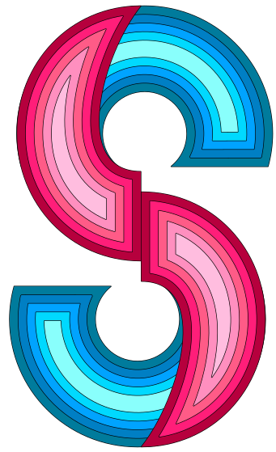
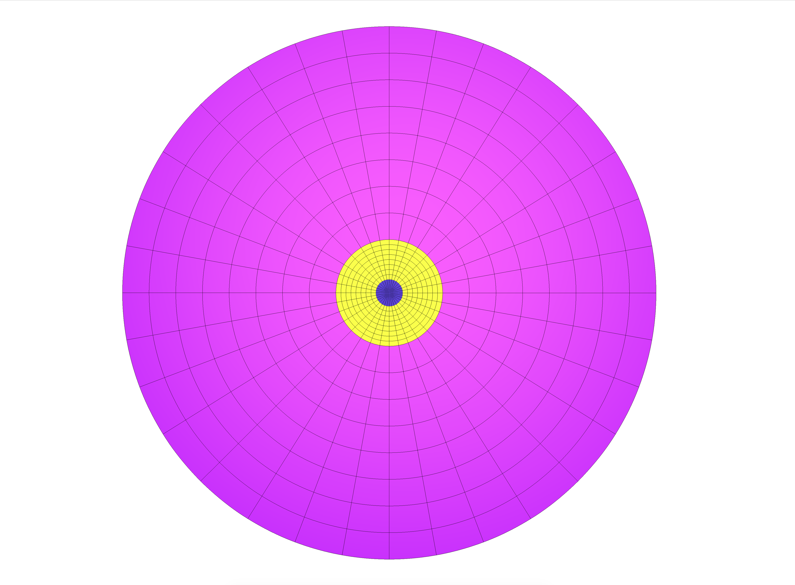
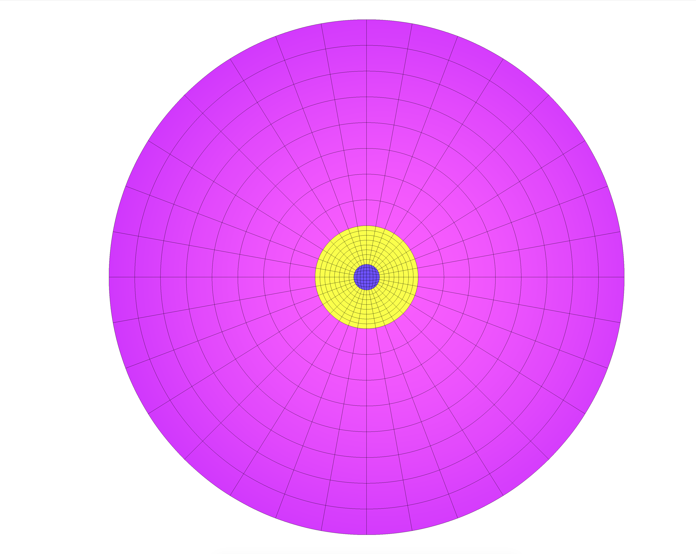
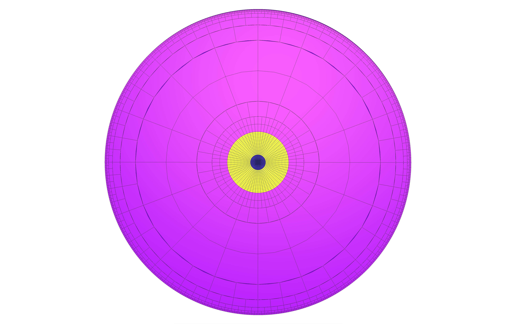

# Stroid
## A multi-block mesh generation tool for stellar modeling

Stroid is a simple multi-block mesh generation tool designed to generate multi-domain
meshes for 3D finite element modeling of stellar physics. It uses the MFEM library for
mesh generation and manipulation and is capable of generating high-order curvilinear
and non-singular meshes.

> Note: Stroid is under active development and is not yet stable. Features and interfaces may change in future releases.

## Building and Installing
Stroid uses meson as its build system, specifically we require version 1.3.0 or higher. Further,
stroid depends on C++23 standard library features, so both a compatible compiler and standard template
library are required. All other dependencies are handled by meson and will be downloaded and built 
automatically.

### Building
```bash
git clone https://github.com/4D-STAR/stroid.git
cd stroid
meson setup build
meson compile -C build
meson test -C build
meson install -C build
```

#### Uninstalling
To uninstall stroid, if you built it using meson and the default ninja backend, you can use the following command
```bash
sudo ninja uninstall -C build
```

### Running
Stroid can be used either from the command line or from C++. The command line interface is
the simplest way to get started. After installation, the `stroid generate` command should be available in your terminal.

```bash
stroid generate --help
```

The main way to interface with this is through the subcommands (currently only `generate` and `info` are available):

```bash
stroid generate -c <path/to/config/file.toml>
```

One can change the output format by specificing one of the avalible output formats __after__ generation options

```bash
stroid generate -c <path/to/config/file.toml> -o "output.vtu" vtu --ref 1
```

each output format has its own options, which can be viewed by running

```bash
stroid generate [fmt] --help
```

where ``[fmt]`` is replaced with the desired output format (e.g. vtu, netgen, mfem, etc.). Avalible output formats are:

- vtu: VTK Unstructured Grid format
- mfem: MFEM mesh format
- netgen: Netgen mesh format
- vtk: Legacy VTK format
- paraview: ParaView Data collection format
- info: Outputs mesh information to the terminal

Further, mesh generation options are loaded from a toml file, a default version of this file can be saved by running
```bash
stroid info -d
```
which will save a default config file to ``default.toml``

### Configuration File
Stroid uses a TOML configuration file to specify the parameters for mesh generation. An example configuration
file is found below

```toml
[main]
refinement_levels = 2
order = 3
include_external_domain = true
r_core = 1.5
r_star = 5.0
flattening = 0.08
r_infinity = 6.0
r_instability = 1e-14
core_steepness = 1.0
surface_bdr_id = 1
inf_bdr_id = 2
core_id = 1
envelope_id = 2
vacuum_id = 3
core_mapping = "multi_block"


[main.optimization_methods]
tmop = false
smoothstep = true
```

<!-- Table of what these parameters do -->
| Parameter                       | Description                                                                                                                                                                                                                                        | Default       |
|---------------------------------|----------------------------------------------------------------------------------------------------------------------------------------------------------------------------------------------------------------------------------------------------|---------------|
| refinement_levels               | Stellar minimum depth, or uniform depth when vacuum overrides are omitted                                                                                                                                                                          | 4             |
| order                           | The polynomial order of the finite elements in the mesh                                                                                                                                                                                            | 3             |
| include_external_domain         | Whether to include an external domain extending to r_infinity                                                                                                                                                                                      | true          |
| r_core                          | The radius of the core region of the star                                                                                                                                                                                                          | 0.25 |
| r_star                          | The radius of the star                                                                                                                                                                                                                             | 1.0 |
| flattening                      | The flattening factor of the star (0 for spherical, >0 for oblate)                                                                                                                                                                                 | 0             |
| r_infinity                      | The outer radius of the external domain (if included)                                                                                                                                                                                              | 6.0           |
| r_instability                   | The radius at which no transformations are applied to the initial topology (to avoid singularities)                                                                                                                                                | 1e-14         |
| core_steepness                  | The steepness of the transition between the core and envelope regions of the star                                                                                                                                                                  | 1.0           |
| surface_bdr_id                  | The boundary ID to assign to the surface of the star                                                                                                                                                                                               | 1             |
| inf_bdr_id                      | The boundary ID to assign to the outer boundary of the external domain (if included)                                                                                                                                                               | 2             |
| core_id                         | The material ID to assign to the core region of the star                                                                                                                                                                                           | 1             |
| envelope_id                     | The material ID to assign to the envelope region of the star                                                                                                                                                                                       | 2             |
| vacuum_id                       | The material ID to assign to the vacuum region of the star (if included)                                                                                                                                                                           | 3             |
| optimization_methods.tmop       | The tmop flag enables or disables the use of TMOP ideal shape unit size metric optimization during mesh generation. This can help improve the quality of the generated mesh, but will dramatically increase the time required for mesh generation. | false         |
| optimization_methods.smoothstep | The smoothstep flag enables or disables the use of a smoothstep function to transition between the core and envelope regions of the star. This can help improve the quality of the generated mesh                                                  | true          |
 | core_mapping                    | The core mapping strategy to use for the mesh generation. Options are "spherified" (legacy) or "multi_block" (conditioned). The multi_block strategy is strongly preferred for its improved condition number.                                      | "multi_block" |


If no configuration file is provided, stroid will use the default parameters listed above. Further, configuration files
need only include parameters that differ from the defaults. For compatibility with older TOML files,
an omitted `core_mapping` uses `"spherified"`, and omitted TMOP controls leave optimization disabled.
Set `core_mapping = "multi_block"` explicitly to use the conditioned mapping in a TOML file.
Default-constructed C++ and Python `MeshConfig` objects select `"multi_block"`; other omitted TOML
geometry fields use the defaults from `MeshConfig`.

### Conditioned core mapping

There are two core mapping strategies, spherified and multi_block. Generally multi_block should be strongly preferred. The
`core_mapping = "multi_block"` strategy avoids the radial rank loss at the eight corners of the spherified core
block. It uses a Cartesian center plus six transition blocks inside the core. The inner cube has circumscribed radius
`r_core / 2`; its six faces connect linearly to the existing spherical `r_core` interface. If enabled, spheroidal flattening is
applied afterwards. 

```python
cfg = stroid.config.MeshConfig(core_mapping="multi_block", refinement_levels=2)
cfg.optimization_methods = stroid.config.OptimizationMethods(tmop=False)
mesh = stroid.GenerateMesh(cfg)
```

The optional, non-installed `geometry_quality_experiment` target may be used to measure the actual high-order geometry
at quadrature points, vertices, edges, and near-corner probes. You may build and run it explicitly:

```bash
meson compile -C build geometry_quality_experiment
build/tools/geometry_quality_experiment --orders 4 --refinements 2 \
    --contraction-probe --probe-order 3 --output core_comparison.csv
```

### Nonconforming vacuum refinement

Stroid can keep the star and both ends of the vacuum well resolved while using
coarser elements in the vacuum interior. Refinement is isotropic: each refinement
splits a hexahedron into eight children. Note however that only one geometric polynomial `order` applies
to every region.

```toml
[main]
refinement_levels = 4
vacuum_refinement_levels = 2
# Optional: omitted outer depth inherits refinement_levels (4 here).
# vacuum_outer_refinement_levels = 4
order = 3
include_external_domain = true
core_mapping = "multi_block"

[main.optimization_methods]
tmop = false
smoothstep = true
```

`configs/nonconforming_vacuum.toml` provides a complete example. The three depth
settings are absolute minimum targets measured from the initial block topology:

| Setting                          | Applies to                               | Default                     |
|----------------------------------|------------------------------------------|-----------------------------|
| `refinement_levels`              | Core and envelope                        | `4`                         |
| `vacuum_refinement_levels`       | Vacuum interior                          | Inherit `refinement_levels` |
| `vacuum_outer_refinement_levels` | Cells touching the vacuum outer boundary | Inherit `refinement_levels` |

Omitting both vacuum overrides preserves uniform generation. Supplying either
activates the local refinement policy and requires `include_external_domain = true`.
All levels must be nonnegative integers.

Stroid enforces that vacuum cells touching the stellar surface match the stellar face subdivision. That is to say that
the inner boundary of the vacuum region is conforming to the outer boundary of the stellar region. Further, the
outer-boundary cells receive the outer target, and automatic grading limits neighboring refinement depths to one level.
This two layer approach is intended to allow for refinement when using compactification maps.

```python
import stroid

cfg = stroid.config.MeshConfig(
    refinement_levels=4,
    vacuum_refinement_levels=2,
    vacuum_outer_refinement_levels=None,  # Inherit stellar depth.
    order=3,
    core_mapping="multi_block",
    optimization_methods=stroid.config.OptimizationMethods(tmop=False),
)
mesh = stroid.GenerateMesh(cfg)
features = stroid.stats.MESH_STAT_DEFAULT | stroid.stats.MeshStatFeatures.ELEMENT_COUNT
stats = stroid.stats.ComputeMeshStats(mesh, features)
print(stats.element_counts.vacuum)
print(stats.refinement.vacuum.min_depth, stats.refinement.vacuum.max_depth)
print(stats.refinement.geometry_dofs, stats.refinement.geometry_true_dofs)
print(stats.conformity.conforming, stats.conformity.n_nonconforming_faces)

stroid.IO.SaveStroidMesh(mesh, "graded.stroid")
restored = stroid.IO.LoadStroidMesh("graded.stroid")
stroid.refinement.UniformRefinement(restored, 1)
```


The `UniformRefinement(mesh, n)` function adds `n` levels to every current leaf while preserving the
existing grading, and rebuilds the geometry and exterior coordinate. Note that this means that a non-conforming mesh
that has been Uniformly refined will still be non-conforming, but the refinement will be applied to all leaves.

#### Viewing curved meshes in GLVis

It is important to note --- and potentially confusing if not understood --- that GLVis approximates curved faces with
flat triangles. At a hanging interface, the same subdivision count on a coarse face and its finer neighbors samples the
curved surface at different locations. This can produce apparent gaps even when the finite-element face transformations
agree. These gaps are not indications that the mesh itself is non-conforming; rather, they are a visualization artifact.

### C++ Interface
Stroid can be used as a library in C++ projects. After installation, include the stroid header and link against the stroid library.

A basic example of using stroid in C++ is shown below (note that you will need a glvis instance running on localhost:19916 to visualize the mesh):
```c++
#include "stroid/stroid.h"

int main() {
    stroid::config::MeshConfig cfg;
    cfg.refinement_levels = 4;
    cfg.vacuum_refinement_levels = 2;
    cfg.optimization_methods = stroid::config::OptimizationMethods{false, true};

    auto mesh = stroid::GenerateMesh(cfg);
    stroid::IO::SaveStroidMesh(mesh, "graded.stroid");
    stroid::IO::ViewMesh(mesh, "Spheroidal Mesh", stroid::IO::VISUALIZATION_MODE::ELEMENT_ID, "localhost", 19916);
}
```

## Example Meshes
An example mesh with the default configuration parameters is shown below (coloration indicates attribute IDs of different regions):


The legacy spherified core mapping strategy is shown below as well


An example of a non-conforming mesh generated with stroid. Note that the gaps between elements are a visualization artifact
rather than true gaps within the mesh.


Note that both of these meshes are shown with 3 levels of refinement and polynomial order 3. Blue shows the core
domain, yellow shows the envelope domain, while purple shows the vacuum domain.


## Funding
Stroid is developed as part of the 4D-STAR project.

4D-STAR is funded by European Research Council (ERC) under the Horizon Europe programme (Synergy Grant agreement No.
101071505: 4D-STAR)
Work for this project is funded by the European Union. Views and opinions expressed are however those of the author(s)
only and do not necessarily reflect those of the European Union or the European Research Council.
